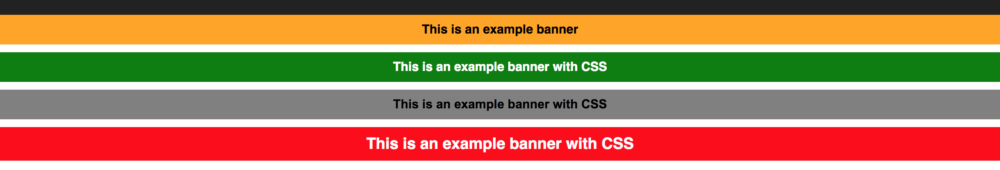

# react-js-banner

Simple React JS line banner Component with fade in and fade out animation.

# Description

It is a simple line text banner component (like warning, error, success). 
Styles (font and background) can be customized. By default the banner has a fade in and fade out animation of 2s. This can be used in two ways, banner can be shown for a specific amount of time using visibleTime prop, or can be handled manually by making the title text null or changing the string.

# How it looks



**How to thank me?**
Just click on ⭐️ button :)

# Installation

Install it from npm and include it in your React build process (using Webpack, Browserify, etc).

```
npm i react-js-banner
```

# Usage

Import `Banner` in your react component.

```
import Banner from 'react-js-banner';
```

Example:

```javascript
<Banner 
	title={this.state.bannerMessage} 
	css={this.state.bannerCss} 
/>
```

If you want the banner to be available for a specific amount of time, visibleTime prop can be passed:

```javascript
<Banner 
  title="This is an example banner with CSS" 
  css={this.state.banner3Css} 
  visibleTime={3000}
/>
```

For instance, you can define the background color, font color, font family, size, etc.

```java
{
  banner1Css: { color: "#FFF", backgroundColor: "green" },
  banner2Css: { color: "#000", backgroundColor: "grey", fontFamily: "arial" },
  banner3Css: { color: "#FFF", backgroundColor: "red", fontSize: 20 }
}
```

Example of banner with image:

``` html
<Banner 
  title="This is an example banner with CSS and Image" 
  image={logo} 
  imageClass="App-logo"
  css={this.state.banner2Css}
/>

```

New! Now the banner accepts a list of children to display all content data
```
<Banner showBanner={true}>
  <div>
    <h1>h1</h1>
    <h2>h2</h2>
    <h3>h3</h3>
  </div>
</Banner>
```

Props available:
* title (banner title/message)
* css (style for the banner)
* visibleTime (time in ms that the banner will be shown)
* image (image to show left of banner)
* imageClass (css class to customize image)


# Props

| Name        | Type            | Mandatory | Description  
| ------------- |:-------------:| -----:|:-----|
| title      | String | N | Adding some text will make the banner appear |
| css | object     | N|  CSS customizations |
| visibleTime | int     | N|  time in ms you want the banner to be visible |
| image | String     | N|  image to appear at the left of text |
| imageClass | String     | N|  image css class e.g "image-customized-class" |
| transitionAppearTime | number| N|  time for the banner to appear |
| transitionTime | number | N|  time for the transition to take |
| showBanner | bool | N|  force the banner to show or hide, this will override the `visibleTime` variable |


# Changelog

### v0.5.2
* Removed polyfill as dependency

### v0.5.0
* Added ability to accept children:

e.g

```
<Banner showBanner={true}>
  <div>
    <h1>h1</h1>
    <h2>h2</h2>
    <h3>h3</h3>
  </div>
</Banner>
```

### v0.4.1
* Size optimizations

### v0.4.0
* Dependencies updated

### v0.3.0
* Added ability to show / hide banner whenever is required via new showBanner prop
* If the prop is not defined will show the banner if it has a title defined
* Banner can render HTML snippets

### v0.2.5
* Added transition show and hide times as prop
* Added appear time as prop

### v0.2.2
* Bug fixing
* Prop types added

### v0.2.1
* Feature for adding images to banner added

### v0.2.0
* Visible time feature added

### v0.1.0
* Initial release


# License 

Licensed under the MIT License © [jciccio](https://www.npmjs.com/~jciccio)
