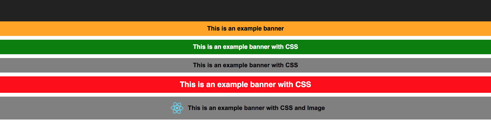

# react-js-banner

Simple React JS line banner Component with fade in and fade out animation.

# Description

It is a simple line text banner component (like warning, error, success). 
Styles (font and background) can be customized. By default the banner has a fade in and fade out animation of 2s. This can be used in two ways, banner can be shown for a specific amount of time using visibleTime prop, or can be handled manually by making the title text null or changing the string.

# How it looks



**How to thank me?**
Just click on ⭐️ button or buy me a tea using the donation button below :)

# Installation

Install it from npm and include it in your React build process (using Webpack, Browserify, etc).

``` console
npm i react-js-banner
```

# Usage

Import `Banner` in your react component.

``` javascript
import Banner from 'react-js-banner';
```

Example:

```javascript
<Banner 
  id="banner1"
  title="This is an example Banner Title" 
  css={{ color: "#000", backgroundColor: "grey", fontFamily: "arial" }} 
/>
```

If you want the banner to be available for a specific amount of time, visibleTime prop can be passed:

```javascript
<Banner 
  id="banner2"
  title="This is an example banner with CSS" 
  css={{color: "#FFF", backgroundColor: "red", fontSize: 20 }} 
  visibleTime={3000}
/>
```

For instance, you can define the background color, font color, font family, size, etc.

```javascript
{
  banner1Css: { color: "#FFF", backgroundColor: "green" },
  banner2Css: { color: "#000", backgroundColor: "grey", fontFamily: "arial" },
  banner3Css: { color: "#FFF", backgroundColor: "red", fontSize: 20 }
}
```

Example of banner with image:
```javascript
import logo from './logo.svg';
```
``` html
<Banner 
  id="banner3"
  title="This is an example banner with CSS and Image" 
  image={logo} 
  imageClass="App-logo"
  css={this.state.banner2Css}
/>

```

New! Now the banner accepts a list of children to display all content data to make it more extensible!
``` html
<Banner id="banner4">
  <div>
    <h1>h1</h1>
    <h2>h2</h2>
    <h3>h3</h3>
  </div>
</Banner>
```

# Props

| Name        | Type            | Mandatory | Description  
| ------------- |:-------------:| -----:|:-----|
| id      | String | Y | Banner Id you want to use |
| title      | String | N | Adding some text will make the banner appear |
| css | object     | N|  CSS customizations |
| visibleTime | number     | N|  time in seconds you want the banner to be visible |
| image | String     | N|  image to appear at the left of text |
| imageClass | String     | N|  image css class e.g "image-customized-class" |
| transitionAppearTime | number| N|  time for the banner to appear |
| transitionTime | number | N|  time for the transition to take |
| showBanner | bool | N|  force the banner to show or hide, this will override the `visibleTime` variable |
| onHideCallback | function | N|  callback when the popup hides (to be used with visible time prop in manage state, will pass as param the banner id) |

# Donations

If you think that any information you obtained here is useful and worth of some money and are willing to pay for it, feel free to send any amount through Paypal :)

[](https://www.paypal.com/cgi-bin/webscr?cmd=_s-xclick&hosted_button_id=2MSMEVFF9P33N)

You can also follow me on Patreon:
https://patreon.com/Jacware


# Changelog


### v0.7.0
#### Changes and features
* New function callback when the popup hides. This should be used with the visible time prop, call and return the id given as param
For example: 
``` javascript
<Banner  
  id="banner4"
  title="This is an example banner with CSS and 3 Seconds of Visibility" 
  css={this.state.banner3Css} 
  visibleTime={3000} 
  showBanner={true}
  onHideCallback={(bannerId) => alert('This is an example banner with CSS and 3 Seconds of Visibility Hidden')}
/>
``` 
* Enhanced fade in / out animations
* Several code updates and optimiation to avoid double rendering
* There is no need to use the showBanner prop anymore and will soon be deprecated

#### Breaking Changes
* Banner Id new prop required

#### Other
showBanner prop is under revision and will be deprecated in a future version

### v0.6.1
* Removed Polyfill Dependency
* Package size decreased!

### v0.6.0
* Bug Fixes
* Dependencies updated

### v0.5.2
* Removed polyfill as dependency

### v0.5.0
* Added ability to accept children:

e.g

```
<Banner showBanner={true}>
  <div>
    <h1>h1</h1>
    <h2>h2</h2>
    <h3>h3</h3>
  </div>
</Banner>
```

### v0.4.1
* Size optimizations

### v0.4.0
* Dependencies updated

### v0.3.0
* Added ability to show / hide banner whenever is required via new showBanner prop
* If the prop is not defined will show the banner if it has a title defined
* Banner can render HTML snippets

### v0.2.5
* Added transition show and hide times as prop
* Added appear time as prop

### v0.2.2
* Bug fixing
* Prop types added

### v0.2.1
* Feature for adding images to banner added

### v0.2.0
* Visible time feature added

### v0.1.0
* Initial release


# License 

Licensed under the MIT License © [jciccio](https://www.npmjs.com/~jciccio)
